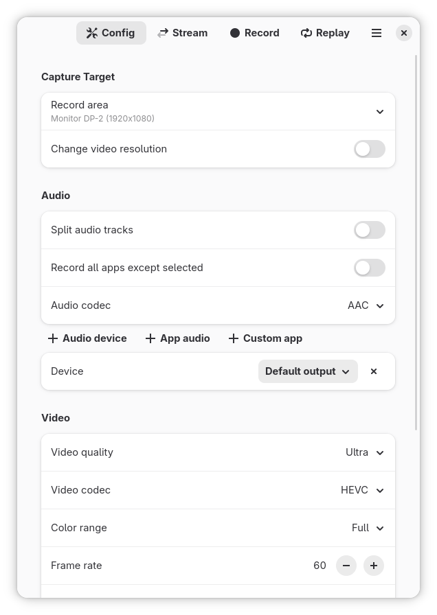

# GPU Screen Recorder (libadwaita port)
GNOME frontend for [GPU Screen Recorder](https://git.dec05eba.com/gpu-screen-recorder/about/).

## Notes
The program has to be launched from your application launcher or hotkeys may not work properly in your Wayland compositor (this is the case with GNOME).

## Installation
The only official ways to install GPU Screen Recorder is either from source.

If you still prefer to install GPU Screen Recorder with a package manager instead of from source then you may be able to find a package for your distro.

Here are some known packages:

* Fedora, CentOS: [COPR](https://copr.fedorainfracloud.org/coprs/brycensranch/gpu-screen-recorder-git/)

# Build from source
```sh
meson setup build
ninja -C build
sudo ninja -C build install
```

## Build options
Both X11 and Wayland backends are enabled by default. Distributions can disable either at compile time:

```sh
# Wayland-only build (no X11 dependency)
meson setup build -Dx11=false

# X11-only build (no Wayland portal shortcuts)
meson setup build -Dwayland=false
```

| Option    | Default | Description                                  |
|-----------|---------|----------------------------------------------|
| `x11`     | `true`  | Enable X11 hotkeys and window picker         |
| `wayland` | `true`  | Enable Wayland global shortcuts via portal   |

# Dependencies
The app uses the meson build system so you need to install `meson` and `ninja`.

## Build dependencies
These are the dependencies needed to build GPU Screen Recorder Adwaita:

* libadwaita (>= 1.8)
* libx11 (optional, required when `-Dx11=true`)
* desktop-file-utils

## Runtime dependencies
There are also additional dependencies needed at runtime:

* [GPU Screen Recorder](https://git.dec05eba.com/gpu-screen-recorder/)

## Screenshots



# Reporting bugs, contributing patches, questions or donation
See [gpu-screen-recorder-adwaita](https://github.com/runlevel5/gpu-screen-recorder-adwaita/issues)
